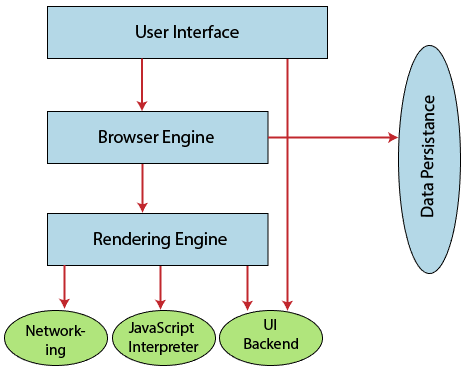

## Exercise 1.1
***Q: What is the main functionality of the browser?***

**Answer:** The main function is to retrieve information from the World Wide Web and making it available for users. Visiting any website can be done using a web browser. When a URL is entered in a browser, the web server takes us to that website.

***Q: What are the High Level Components of a browser.***

**A:** The high level components of a browser are : The User Interface, The Browser Engine, The Rendering Engine, Networking, JavaScript Interpreter, UI Backend, Data Persistence/Storage.

***Q: Rendering engine and its use.***

**A:** The rendering engine will start parsing the HTML document and convert elements to DOM nodes in a tree called the "content tree". The engine will parse the style data, both in external CSS files and in style elements. Styling information together with visual instructions in the HTML will be used to create another tree: the render tree.

***Q: What is the a parser in (html and css).***

**A:** Parsing a document means translating it to a structure the code can use. The result of parsing is usually a tree of nodes that represent the structure of the document. This is called a parse tree or a syntax tree.

***Q: What are the script processors.***

**A:** The script processor executes Javascript code to process an event. The processor uses a pure Go implementation of ECMAScript 5.1 and has no external dependencies. This can be useful in situations where one of the other processors doesn’t provide the functionality you need to filter events.

***Q: What is a tree construction.***

**A:** While the DOM tree is being constructed, the browser constructs another tree, the render tree. This tree is of visual elements in the order in which they will be displayed. It is the visual representation of the document. The purpose of this tree is to enable painting the contents in their correct order. Firefox calls the elements in the render tree “frames”. WebKit uses the term renderer or render object.

***Q: What is Order of script processing.***

**A:** The model of the web is synchronous. Authors expect scripts to be parsed and executed immediately when the parser reaches a script tag. The parsing of the document halts until the script has been executed. If the script is external then the resource must first be fetched from the network - this is also done synchronously, and parsing halts until the resource is fetched. This was the model for many years and is also specified in HTML4 and 5 specifications. Authors can add the "defer" attribute to a script, in which case it will not halt document parsing and will execute after the document is parsed. HTML5 adds an option to mark the script as asynchronous so it will be parsed and executed by a different thread.

***Q: What is Layout and Painting.***

**A:** After the construction of the render tree, it goes through a “layout process” of the render tree. When the renderer is created and added to the tree, it does not have a position and size. The process of calculating these values is called layout or reflow. This means giving each node the exact coordinates where it should appear on the screen. The position of the root renderer is 0,0 and its dimensions are the viewport–the visible part of the browser window. All renderers have a “layout” or “reflow” method, each renderer invokes the layout method of its children that need layout.The next stage is painting. In the painting stage, the render tree is traversed and the renderer’s “paint()” method is called to display content on the screen. Painting uses the UI backend layer.The rendering engine always tries to display the contents on the screen as soon as possible for better user experience. It does not wait for the HTML parsing to complete before starting to build and layout the render tree. It parses and displays the content it has received from the network, while rest of the contents stills keeps coming from the network.

